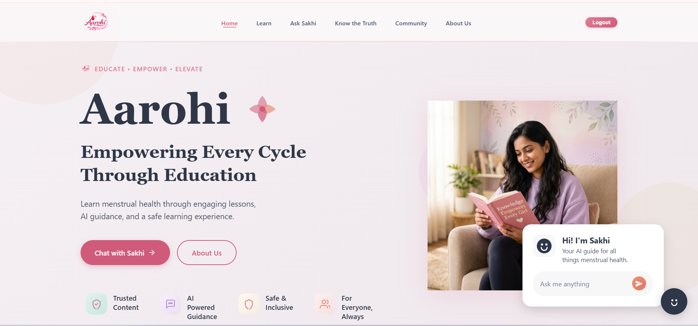
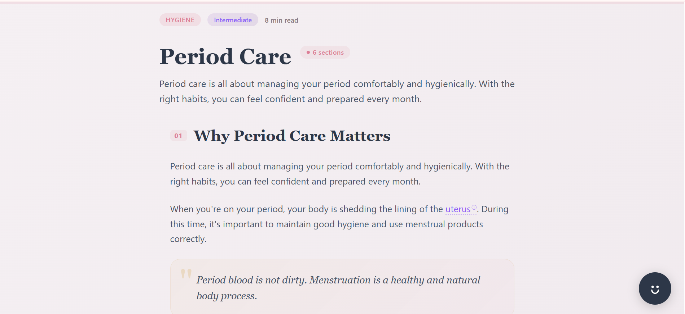
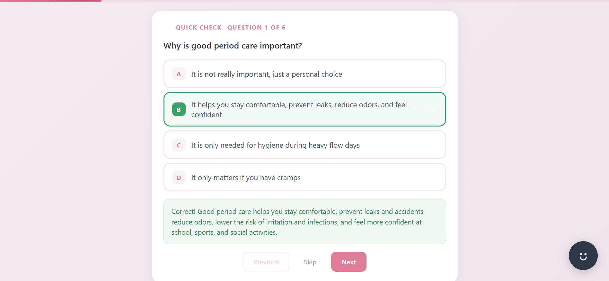
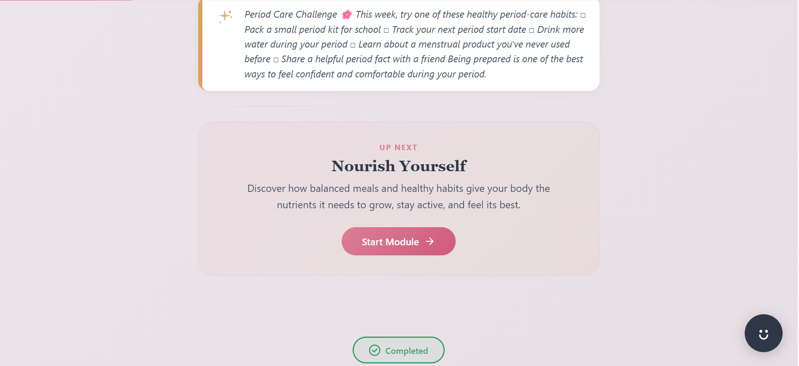
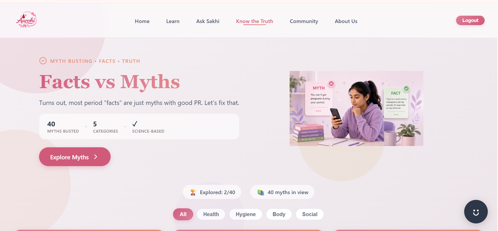
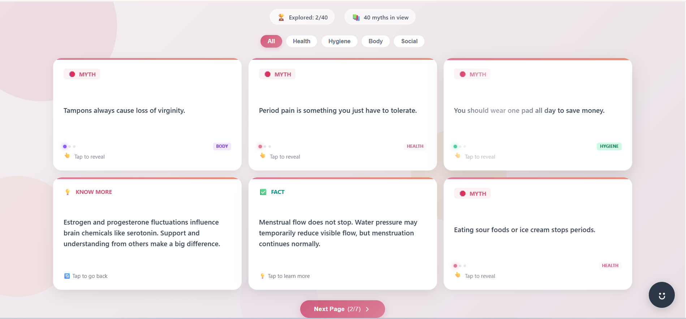

# Aarohi

> Empowering Every Cycle Through Education

Aarohi is an AI-powered menstrual health education platform that provides adolescents with reliable, beginner-friendly, and stigma-free learning. It combines structured educational modules, interactive quizzes, myth-busting resources, and an AI assistant named **Sakhi** to create a safe space where users can learn and ask questions confidently.

---

## Overview

Menstrual health education is still surrounded by misinformation, myths, and social stigma. Many adolescents hesitate to ask questions openly and often rely on unreliable online information.

Aarohi addresses this challenge by providing structured lessons, trusted educational content, interactive assessments, an AI-powered assistant, and a myth-busting platform—all in one place.

---

## Features

- Structured learning modules
- Interactive quizzes after every lesson
- AI-powered menstrual health assistant (Sakhi)
- Myths vs Facts learning experience
- Learning progress tracking
- Medical glossary support
- Conversation history
- Secure authentication
- Responsive user interface

---

## Learning Journey

```text
Home
   ↓
Learn Modules
   ↓
Interactive Lessons
   ↓
Quiz Assessment
   ↓
Progress Tracking
   ↓
Ask Sakhi (AI Assistant)
   ↓
Myths vs Facts
```

---

## Screenshots

<table>
<tr>
<td width="50%">

### Home


</td>

<td width="50%">

### Learning Modules


</td>
</tr>

<tr>
<td width="50%">

### Lesson


</td>

<td width="50%">

### Interactive Quiz


</td>
</tr>

<tr>
<td width="50%">

### Lesson Completion


</td>

<td width="50%">

### Meet Sakhi


</td>
</tr>

<tr>
<td width="50%">

### Sakhi Conversation


</td>

<td width="50%">

### Facts vs Myths


</td>
</tr>

<tr>
<td width="50%">

### Myth Cards


</td>

<td></td>
</tr>
</table>
---

## Tech Stack

| Layer | Technology |
|-------|------------|
| Frontend | React, Vite, JavaScript, CSS |
| Backend | Node.js, Express.js |
| Database | MongoDB, Mongoose |
| AI | Google Gemini API |
| Authentication | JWT, bcrypt |
| HTTP Client | Axios |

---

## Architecture

The project follows a client-server architecture.

### Frontend

- React
- Vite
- React Router
- Axios

### Backend

- Express REST API
- JWT Authentication
- Gemini AI Integration

### Database

- MongoDB
- Mongoose ODM

### AI Layer

Sakhi uses Google Gemini to answer menstrual health questions in a safe, beginner-friendly, and supportive manner.

---

## Project Structure

```text
client/
├── assets
├── components
├── context
├── pages
├── services
└── styles

server/
├── config
├── controllers
├── middleware
├── models
├── routes
├── services
└── utils
```

---

# Getting Started

## Prerequisites

- Node.js (18+)
- MongoDB
- Google Gemini API Key

---

## Clone Repository

```bash
git clone <YOUR_REPOSITORY_URL>
cd Aarohi
```

---

## Install Dependencies

### Backend

```bash
cd server
npm install
```

### Frontend

```bash
cd client
npm install
```

---

## Environment Variables

Create a `.env` file inside the **server** directory.

```env
PORT=5000

MONGO_URI=your_mongodb_connection_string

JWT_SECRET=your_jwt_secret

GEMINI_API_KEY=your_gemini_api_key
```

---

## Run the Application

### Backend

```bash
cd server
npm run dev
```

### Frontend

```bash
cd client
npm run dev
```

---

## AI Assistant (Sakhi)

Sakhi is an AI-powered menstrual health companion built using Google Gemini.

It helps users by providing:

- Science-backed guidance
- Beginner-friendly explanations
- Private conversations
- Context-aware responses
- Safe and judgment-free support

---

## Future Improvements

- Personalized learning recommendations
- Menstrual cycle tracking
- Video learning modules
- Multilingual support
- Offline learning mode
- Expert-reviewed educational resources

---

## Contributors

- Rakshita Dadhich
- Ritu Saini
- Ridhima Bhardwaj

---

## License

This project was developed for educational and hackathon purposes.

---

<p align="center">
Made with ❤️ by Team Aarohi
</p>
